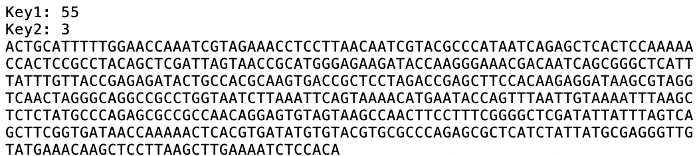

# DNAsteg
DNA steganography

DNAsteg is a command-line tool for encoding and decoding steganographic DNA. Given an arbitrary message, a DNA sequence, and a key, the tool outputs a steganographic DNA sequence that may be synthesized and manipulated through standard laboratory methods such as PCR, and even introduced into a host organism through molecular cloning protocols. Additionally, given a key and an input DNA sequence, DNAsteg can extract the hidden message.

## Usage:
To encode a message, use the '-c' switch to indicate 'conceal' mode, the '-i' switch to designate the input DNA sequence (in FASTA format), the '-m' switch to indicate the message (in string format), the '-o' switch to name the output file for the steganogrphic DNA, and the '-k' switch to designate a key (an integer between 0 and 255). For example, to encode the message "Vexilla regis prodeunt inferni" in the sequence for the coat protein from the P22 bacteriophage, we use the following command:

DNAsteg.py -c -i gp5.txt -m 'Vexilla regis prodeunt inferni' -o inferni.txt -k 55

Here is the input DNA:

And here is the output steganographic DNA:

To reverse the process, simply use the '-r' switch (for 'read'), the '-i' switch to indicate the input (steganographic) DNA file, and the '-k' switch to designate the key:

DNAsteg.py -r -i inferni.txt

This reproduces the original message:
Vexilla regis prodeunt inferni
